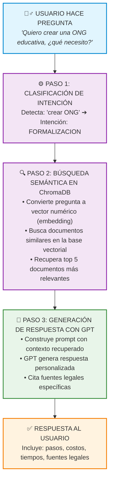
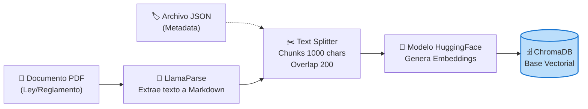
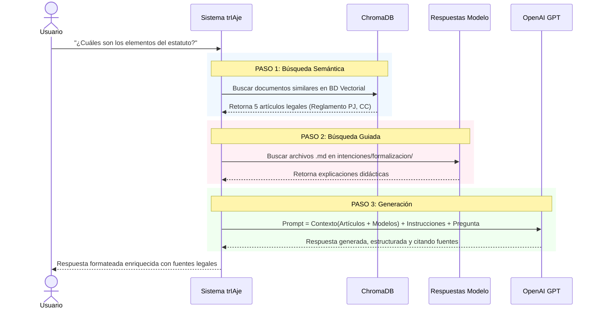

# DOCUMENTACIÓN DEL SISTEMA RAG - trIAje

## 📋 ÍNDICE

1. [Introducción y Propósito](#introducción-y-propósito)
2. [Arquitectura General](#arquitectura-general)
3. [Componentes Principales](#componentes-principales)
4. [Flujo de Funcionamiento](#flujo-de-funcionamiento)
5. [Base de Conocimiento](#base-de-conocimiento)
6. [Tecnologías Utilizadas](#tecnologías-utilizadas)
7. [Configuración y Uso](#configuración-y-uso)
8. [Análisis de Código](#análisis-de-código)

---

## 1. Visión General: ¿Qué es el Sistema RAG?

El sistema RAG (Retrieval Augmented Generation) de trIAje es una solución de asistencia legal especializada para ONGs en Perú. A diferencia de una base de datos tradicional, este sistema combina:

- **Búsqueda semántica**: Entiende el significado de las preguntas, no solo las palabras exactas
- **Generación de respuestas**: Usa modelos de lenguaje (GPT) para crear respuestas personalizadas
- **Contexto legal**: Combina documentos legales oficiales con explicaciones didácticas

### ¿Por qué NO es solo una base de datos?

**Problema de una BD tradicional:**
```
Usuario pregunta: "¿Cómo hago para crear una ONG?"
Base de datos: ❌ No encuentra coincidencia exacta
```

**Solución con RAG:**
```
Usuario pregunta: "¿Cómo hago para crear una ONG?"
RAG entiende que es similar a:
- "¿Cómo constituir una asociación?"
- "¿Qué pasos para formalizar mi ONG?"
- "Quiero crear una organización sin lucro"
✅ Encuentra información relevante y genera respuesta personalizada
```

---

## 2. ARQUITECTURA GENERAL

### Diagrama de Flujo Completo



### Componentes del Sistema

```
RAG/
├── rag_demo.py              # Sistema RAG principal (clase LegalRAG)
├── test_busqueda.py         # Script de prueba de búsqueda
├── rag_system/              # Módulos del sistema
│   ├── etl/                 # Procesamiento de documentos
│   │   └── process_documents.py
│   └── rag/                 # (Vacío - en desarrollo)
├── knowledge_base/          # Base de conocimiento
│   ├── intenciones/         # Respuestas modelo por intención
│   ├── metadata/            # Metadata de PDFs legales
│   ├── normas/              # PDFs de leyes organizados
│   └── preguntas/           # Catálogo de preguntas
├── chroma_db/               # Base de datos vectorial
└── docs/                    # Documentación técnica
```

---

## 3. COMPONENTES PRINCIPALES

### 3.1 Sistema RAG Principal (rag_demo.py)

**Clase: LegalRAG**

Esta es la clase principal que orquesta todo el sistema RAG.

**Métodos principales:**

1. **`__init__()`** - Inicialización
   - Carga el modelo de embeddings multilingüe
   - Conecta a ChromaDB
   - Configura cliente OpenAI
   - Verifica que hay 465 documentos cargados

2. **`buscar_en_pdfs(query, k=5)`** - Búsqueda en documentos legales
   - Recibe una pregunta del usuario
   - Busca los k documentos más similares en ChromaDB
   - Usa búsqueda por similitud semántica
   - Retorna lista de documentos relevantes

3. **`buscar_respuesta_modelo(intencion)`** - Búsqueda de respuestas modelo
   - Busca archivos .md con explicaciones didácticas
   - Organizado por intención (ej: "formalizacion")
   - Lee primeros 2000 caracteres de cada archivo
   - Retorna lista de respuestas modelo

4. **`generar_respuesta(query, articulos, respuestas_modelo)`** - Generación con GPT
   - Construye contexto combinando artículos legales y respuestas modelo
   - Crea prompt estructurado para GPT
   - Configura temperatura 0.3 (respuestas consistentes)
   - Genera respuesta de máximo 1500 tokens

5. **`responder(query, intencion)`** - Método principal
   - Orquesta todo el flujo RAG
   - Llama a los 3 métodos anteriores en secuencia
   - Muestra resultado formateado con fuentes

### 3.2 Procesador de Documentos (process_documents.py)

**Clase: DocumentProcessor**

Responsable del proceso ETL (Extract, Transform, Load) de documentos legales.

**Pipeline ETL (Extracción, Transformación y Carga):**



**Métodos principales:**

1. **`__init__(llama_api_key)`** - Configuración
   - Inicializa LlamaParse para extraer texto de PDFs
   - Configura RecursiveCharacterTextSplitter (chunks de 1000 caracteres, overlap 200)
   - Carga modelo de embeddings HuggingFace

2. **`load_metadata(doc_id)`** - Carga metadata
   - Lee archivo JSON con información del documento
   - Incluye: tipo, categoría, título, etc.

3. **`parse_pdf(pdf_path)`** - Extracción de texto
   - Usa LlamaParse para convertir PDF a markdown
   - Maneja PDFs complejos con tablas y estructura

4. **`create_chunks(text, metadata)`** - División en chunks
   - Divide texto en fragmentos de 1000 caracteres
   - Agrega metadata a cada chunk (chunk_id, chunk_total)
   - Retorna lista de objetos Document

5. **`process_document(pdf_path, doc_id)`** - Proceso completo
   - Ejecuta: cargar metadata → parsear PDF → crear chunks
   - Retorna documentos listos para vectorizar

6. **`load_to_vectorstore(documents, collection_name)`** - Carga a ChromaDB
   - Vectoriza documentos usando embeddings
   - Almacena en ChromaDB con nombre de colección
   - Persiste en disco

### 3.3 Script de Prueba (test_busqueda.py)

Script simple para verificar que ChromaDB funciona correctamente.

**Funcionalidad:**
- Conecta a ChromaDB
- Ejecuta 4 preguntas de prueba
- Muestra los 3 resultados más relevantes por pregunta
- Imprime metadata y contenido de cada resultado

---

## 4. FLUJO DE FUNCIONAMIENTO

### 4.1 Búsqueda Semántica (Embeddings)

**¿Cómo funciona?**

El sistema convierte texto a vectores numéricos que capturan el significado:

```
Pregunta 1: "¿Cómo constituir una asociación?"          → [0.8, 0.2, 0.5, ...]
Pregunta 2: "¿Qué pasos para formalizar mi ONG?"        → [0.79, 0.21, 0.52, ...]
Pregunta 3: "Quiero crear una organización sin lucro"  → [0.78, 0.19, 0.51, ...]

Similitud entre Pregunta 1 y 2: 0.98 (muy similar)
Similitud entre Pregunta 1 y 3: 0.96 (muy similar)
```

**Resultado:** Las tres preguntas recuperan los mismos documentos relevantes, aunque usen palabras diferentes.

### 4.2 Proceso de Respuesta Completo

**Ejemplo práctico:**



### 4.3 Combinación de Fuentes

El sistema combina DOS tipos de documentos:

**1. Respuestas Modelo (.md)**
- Lenguaje simple y accesible
- Explicaciones paso a paso
- Ejemplos prácticos
- Costos y tiempos estimados

**2. Documentos Legales (PDFs)**
- Texto legal oficial
- Artículos específicos
- Normativa exacta
- Fuente de verdad legal

**Ventaja:** GPT usa ambos para generar respuestas que son precisas legalmente Y fáciles de entender.

---

## 5. BASE DE CONOCIMIENTO

### 5.1 Estructura

```
knowledge_base/
├── intenciones/           # Respuestas modelo organizadas por intención
│   ├── 01_formalizacion/
│   ├── 02_tributacion/
│   ├── 03_cooperacion/
│   └── ...
├── metadata/              # JSON con información de cada PDF
│   ├── reglamento_inscripciones.json
│   ├── ley_notariado.json
│   └── ...
├── normas/                # PDFs legales organizados por categoría
│   ├── civil/
│   ├── tributario/
│   ├── laboral/
│   └── ...
└── preguntas/             # Catálogo de preguntas para entrenamiento
    └── preguntas_estandar.json
```

### 5.2 Base de Datos Vectorial (ChromaDB)

**Colección:** `leyes_peru`
**Total documentos:** 465 chunks
**PDFs procesados:** 4

1. Reglamento de Inscripciones del Registro PJ (107 chunks)
2. DL 1049 - Ley del Notariado (227 chunks)
3. Ley 26366 - Sistema de Registros Públicos (34 chunks)
4. Ley 30424 - Responsabilidad Administrativa (97 chunks)

**Metadata de cada chunk:**
- `doc_id`: Identificador del documento
- `tipo`: Tipo de documento (ley, reglamento, etc.)
- `categoria`: Categoría legal (civil, tributario, etc.)
- `titulo`: Título del documento
- `chunk_id`: Número del chunk
- `chunk_total`: Total de chunks del documento

---

## 6. TECNOLOGÍAS UTILIZADAS

### 6.1 Stack Tecnológico

| Componente | Tecnología | Propósito |
|------------|------------|-----------|
| **Base de datos vectorial** | ChromaDB | Almacenamiento y búsqueda de embeddings |
| **Procesamiento de PDFs** | LlamaParse | Extracción de texto de PDFs complejos |
| **Framework RAG** | LangChain | Orquestación del pipeline RAG |
| **Modelo de lenguaje** | OpenAI GPT | Generación de respuestas |
| **Embeddings** | HuggingFace Transformers | Modelo multilingüe gratuito |
| **División de texto** | RecursiveCharacterTextSplitter | Chunking inteligente |

### 6.2 Modelo de Embeddings

**Modelo:** `sentence-transformers/paraphrase-multilingual-mpnet-base-v2`

**Características:**
- Multilingüe (español e inglés)
- Gratuito y open source
- Optimizado para búsqueda semántica
- Genera vectores de 768 dimensiones
- Normalización de embeddings activada

### 6.3 Configuración de GPT

**Modelo por defecto:** `gpt-3.5-turbo`

**Parámetros:**
- `temperature: 0.3` - Respuestas más consistentes y menos creativas
- `max_tokens: 1500` - Límite de longitud de respuesta
- Sistema: "Eres un asistente legal especializado en ONGs en Perú"

**Costos estimados:**
- gpt-3.5-turbo: ~$0.003 por pregunta
- gpt-4o-mini: ~$0.015 por pregunta
- gpt-4: ~$0.10 por pregunta

---

## 7. CONFIGURACIÓN Y USO

### 7.1 Instalación

**Requisitos:**
```
llama-parse
langchain
langchain-community
chromadb
sentence-transformers
torch
python-dotenv
```

**Pasos:**
```powershell
# 1. Crear entorno virtual
python -m venv venv
.\venv\Scripts\Activate.ps1

# 2. Instalar dependencias
pip install -r requirements.txt

# 3. Configurar variables de entorno
# Crear archivo .env con:
LLAMA_CLOUD_API_KEY=tu-llama-key
OPENAI_API_KEY=tu-openai-key
OPENAI_MODEL=gpt-3.5-turbo
```

### 7.2 Uso del Sistema

**Opción 1: Demo completa**
```powershell
.\venv\Scripts\python.exe rag_demo.py
```
Ejecuta 3 preguntas de prueba y muestra el proceso completo.

**Opción 2: Uso programático**
```python
from rag_demo import LegalRAG

# Inicializar
rag = LegalRAG()

# Hacer pregunta
respuesta = rag.responder(
    "¿Cuáles son los elementos del estatuto?",
    intencion="formalizacion"
)

print(respuesta)
```

**Opción 3: Prueba de búsqueda**
```powershell
.\venv\Scripts\python.exe test_busqueda.py
```
Verifica que ChromaDB funciona correctamente.

### 7.3 Procesamiento de Nuevos PDFs

**Procesar un documento específico:**
```powershell
.\venv\Scripts\python.exe rag_system\etl\process_documents.py --doc nombre_pdf
```

**Procesar una categoría completa:**
```powershell
.\venv\Scripts\python.exe rag_system\etl\process_documents.py --category civil
```

**Procesar todos los documentos:**
```powershell
.\venv\Scripts\python.exe rag_system\etl\process_documents.py --all
```

---

## 8. ANÁLISIS DE CÓDIGO

### 8.1 Clase LegalRAG - Método responder()

```python
def responder(self, query: str, intencion: str = "formalizacion"):
    """Responder pregunta del usuario usando RAG completo"""
    
    # 1. Buscar en PDFs (ChromaDB)
    # Convierte query a embedding y busca documentos similares
    articulos = self.buscar_en_pdfs(query)
    
    # 2. Buscar respuestas modelo (.md)
    # Lee archivos markdown con explicaciones didácticas
    respuestas_modelo = self.buscar_respuesta_modelo(intencion)
    
    # 3. Generar respuesta con GPT
    # Combina artículos + respuestas modelo + prompt
    respuesta = self.generar_respuesta(query, articulos, respuestas_modelo)
    
    return respuesta
```

**Flujo de datos:**
```
query (str) 
  → buscar_en_pdfs() → articulos (List[Document])
  → buscar_respuesta_modelo() → respuestas_modelo (List[Dict])
  → generar_respuesta() → respuesta (str)
```

### 8.2 Búsqueda Semántica

```python
def buscar_en_pdfs(self, query: str, k: int = 5):
    """Buscar artículos relevantes en PDFs (ChromaDB)"""
    
    # similarity_search hace:
    # 1. Convierte query a embedding [0.8, 0.2, ...]
    # 2. Calcula similitud coseno con todos los documentos
    # 3. Retorna top k más similares
    results = self.vectorstore.similarity_search(query, k=k)
    
    return results
```

**Cálculo de similitud:**
```
embedding_query = [0.82, 0.15, 0.67, ...]
embedding_doc1 = [0.81, 0.16, 0.66, ...]

similitud = cosine_similarity(embedding_query, embedding_doc1)
# Resultado: 0.95 (muy similar)
```

### 8.3 Construcción del Prompt

```python
def generar_respuesta(self, query: str, articulos, respuestas_modelo):
    """Usar GPT para generar respuesta"""
    
    # Construir contexto de artículos (primeros 500 chars de cada uno)
    contexto_articulos = "\n\n".join([
        f"[Artículo {i+1}]\n{doc.page_content[:500]}..."
        for i, doc in enumerate(articulos[:3])
    ])
    
    # Construir contexto de respuestas modelo (primeros 800 chars)
    contexto_respuestas = "\n\n".join([
        f"[Respuesta Modelo: {r['archivo']}]\n{r['contenido'][:800]}..."
        for r in respuestas_modelo[:2]
    ])
    
    # Prompt estructurado
    prompt = f"""Eres un asistente legal especializado en ONGs en Perú.
    
CONTEXTO DE ARTÍCULOS LEGALES:
{contexto_articulos}

RESPUESTAS MODELO (usa estas como guía de estructura):
{contexto_respuestas}

PREGUNTA DEL USUARIO:
{query}

INSTRUCCIONES:
1. Responde de forma clara y estructurada (usa markdown)
2. Si hay respuestas modelo, úsalas como guía de estructura
3. Cita los artículos legales relevantes específicamente
4. Si la pregunta es sobre un proceso, explica paso a paso
5. Sé conciso pero completo

RESPUESTA:"""
    
    # Llamar a GPT
    response = self.client.chat.completions.create(
        model=OPENAI_MODEL,
        messages=[
            {"role": "system", "content": "Eres un asistente legal..."},
            {"role": "user", "content": prompt}
        ],
        temperature=0.3,
        max_tokens=1500
    )
    
    return response.choices[0].message.content
```

### 8.4 Procesamiento ETL de Documentos

```python
def process_document(self, pdf_path: Path, doc_id: str = None):
    """Procesa un PDF completo: parse → chunk → metadata"""
    
    # 1. Cargar metadata desde JSON
    metadata = self.load_metadata(doc_id)
    # Ejemplo: {"doc_id": "ley_ir", "tipo": "ley", "categoria": "tributario"}
    
    # 2. Parsear PDF con LlamaParse
    text = self.parse_pdf(pdf_path)
    # Convierte PDF a markdown preservando estructura
    
    # 3. Crear chunks con metadata
    documents = self.create_chunks(text, metadata)
    # Divide en fragmentos de 1000 chars con overlap de 200
    # Cada chunk tiene metadata completa
    
    return documents
```

**Ejemplo de chunk resultante:**
```python
Document(
    page_content="Artículo 82.- La asociación se constituye...",
    metadata={
        "doc_id": "codigo_civil",
        "tipo": "codigo",
        "categoria": "civil",
        "titulo": "Código Civil del Perú",
        "chunk_id": 15,
        "chunk_total": 107
    }
)
```

### 8.5 Parámetros de Chunking

```python
self.text_splitter = RecursiveCharacterTextSplitter(
    chunk_size=1000,        # Tamaño máximo de cada chunk
    chunk_overlap=200,      # Overlap entre chunks consecutivos
    separators=["\n\n", "\n", ". ", " ", ""],  # Prioridad de separadores
    length_function=len     # Función para medir longitud
)
```

**¿Por qué overlap de 200?**
- Evita cortar información en medio de una idea
- Asegura que conceptos relacionados estén en múltiples chunks
- Mejora la recuperación de información completa

---

## RESUMEN EJECUTIVO

### ¿Qué hace el sistema RAG?

1. **Recibe pregunta del usuario** en lenguaje natural
2. **Busca información relevante** en documentos legales y respuestas modelo
3. **Genera respuesta personalizada** usando GPT
4. **Cita fuentes legales** específicas

### Ventajas sobre una base de datos tradicional

✅ Entiende sinónimos y variaciones de preguntas
✅ Combina múltiples fuentes de información
✅ Genera respuestas adaptadas al contexto
✅ Cita fuentes legales precisas
✅ Aprende de nuevos documentos sin reprogramar

### Componentes clave

1. **ChromaDB**: Base de datos vectorial con 465 chunks de documentos legales
2. **LegalRAG**: Clase principal que orquesta búsqueda y generación
3. **DocumentProcessor**: Procesador ETL para nuevos PDFs
4. **Knowledge Base**: Respuestas modelo + PDFs legales + metadata

### Tecnologías principales

- **ChromaDB** para búsqueda vectorial
- **LangChain** para pipeline RAG
- **OpenAI GPT** para generación
- **HuggingFace** para embeddings multilingües
- **LlamaParse** para procesamiento de PDFs

---

**Fecha de documentación:** Febrero 2026
**Versión del sistema:** 1.0
**Estado:** En desarrollo - Fase 1 completada
